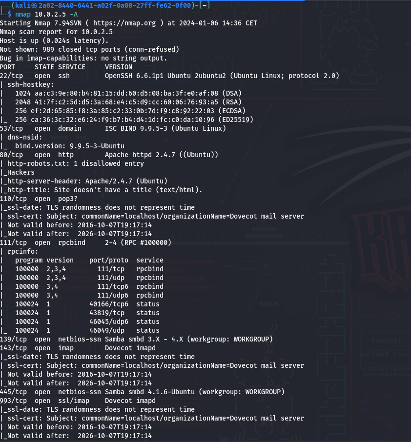
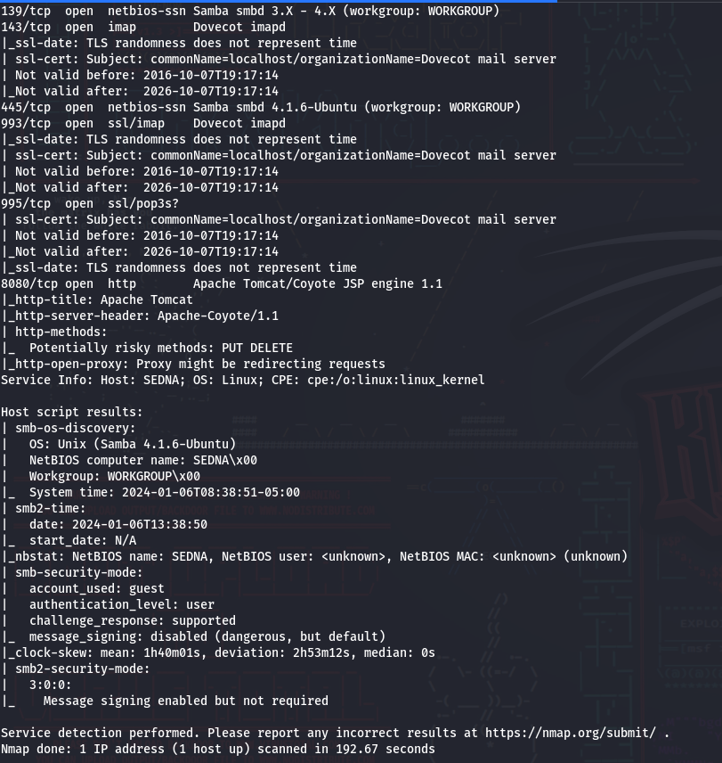
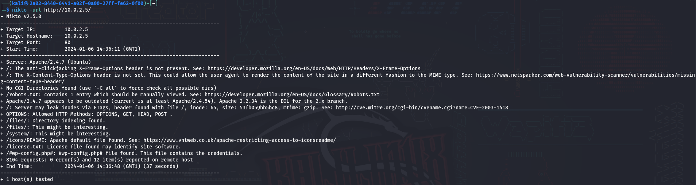
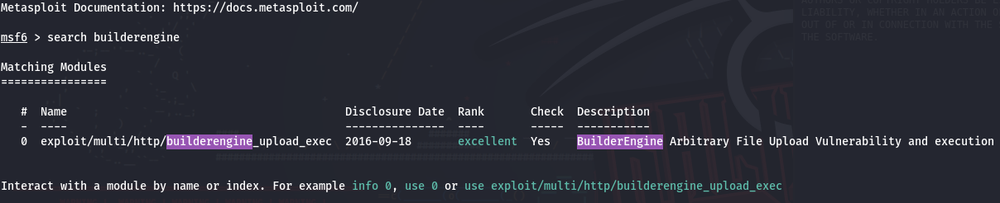
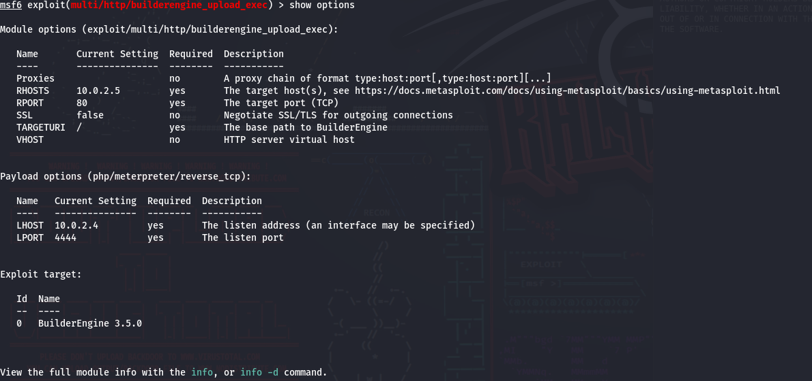
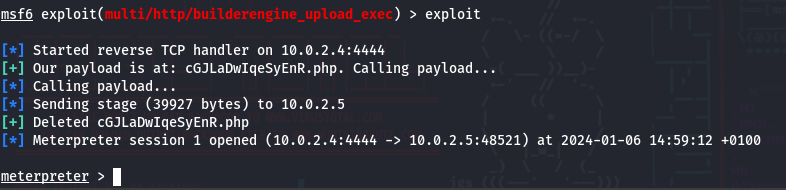
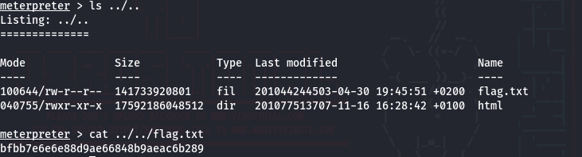
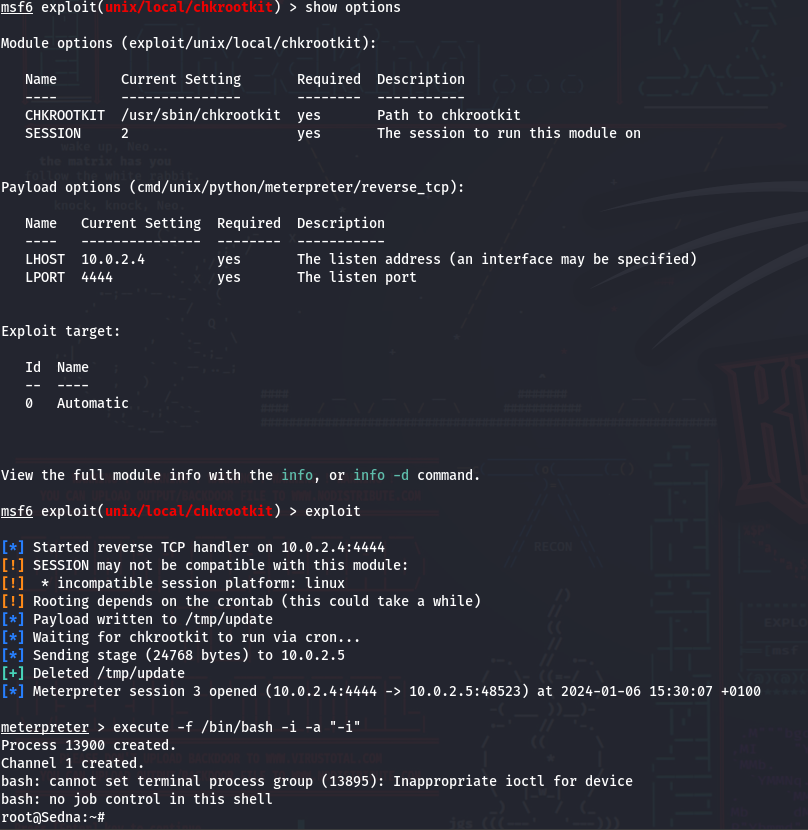
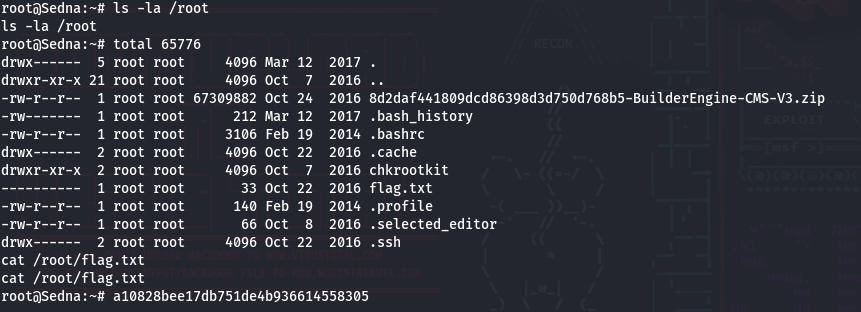

# Sedna  - VulnHub

Reference: [Sedna](https://www.vulnhub.com/entry/hackfest2016-sedna,181/)

Level: Medium

# Enumeration

We will be starting this CTF by enumerating running services:

It seems like there's a webserver running on this VM so let's enumerate it with Nikto and Dirb.

The dirb scan didn't gave anything interesting. But thanks to the Nikto enumeration, we've found a /licence.txt file. In this [file](./license.txt) the engine powering the webserver is `BuilderEngine`. 

# Exploit

The exploit is pretty simple when using metasploit.

# Escalation

I spent hours figuring out this escalation, and i found the solution with a the check root kit (chkrootkit). With metasploit once again the exploit is super simple.

