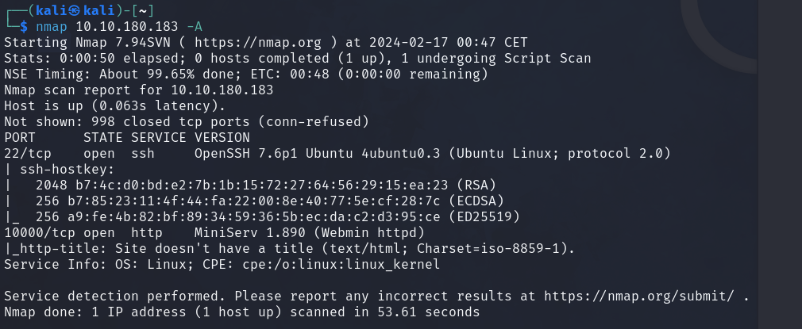
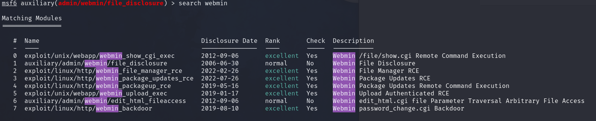
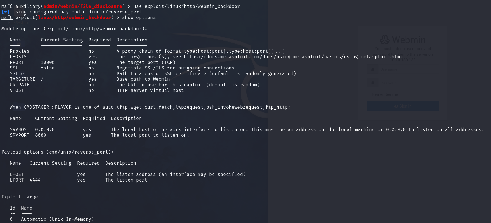
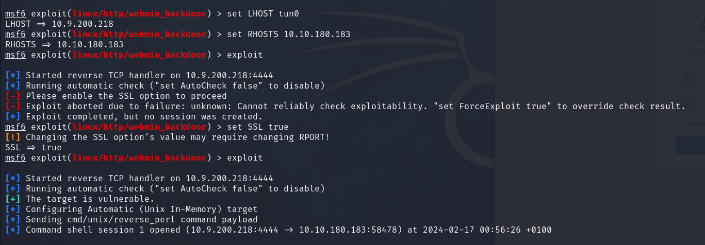
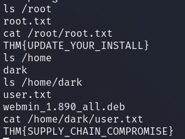

# Source - Try Hack Me

Reference: [Source](https://tryhackme.com/room/source)

Level: Super Easy

Recognition:

The only thing running here should be the vulnerable service Webmin. Wa are using MSF console to find an exploit for this service.

After testing few of them we can see that the backdoor is usable on this VM.

The backdoor directly gave us a root access so we just have to loot the room.

